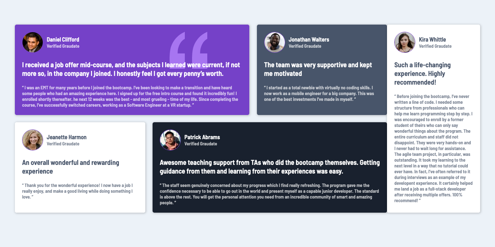

# Frontend Mentor - Testimonials grid section solution

This is a solution to the [Testimonials grid section challenge on Frontend Mentor](https://www.frontendmentor.io/challenges/testimonials-grid-section-Nnw6J7Un7). Frontend Mentor challenges help you improve your coding skills by building realistic projects. 

## Table of contents

- [Overview](#overview)
  - [The challenge](#the-challenge)
  - [Screenshot](#screenshot)
  - [Links](#links)
- [My process](#my-process)
  - [Built with](#built-with)
  - [What I learned](#what-i-learned)
- [Author](#author)
- [Acknowledgments](#acknowledgments)

## Overview

### The challenge

Users should be able to:

- View the optimal layout for the site depending on their device's screen size

### Screenshot



### Links

- Solution URL: [Add solution URL here](https://your-solution-url.com)

## My process

### Built with

- Semantic HTML5 markup
- CSS custom properties
- Flexbox
- Mobile-first workflow

### What I learned
This challenge helped me to learn more flexbox skills and more.
```html
<h1>The team was very supportive and kept me motivated</h1>
```
```css
.proud-of-this-css {
  .grid-item{
    margin-bottom: 20px;
    padding: 20px;
    border-radius: 5px;
    box-shadow: 1px 1px 5px 1px rgba(0,0,0,0.2);
    font-size: 13px;
    font-weight: 600;
}
}
```

## Author

- Email - [Abdallah Aminu Daneji](waad2lf@gmail.com)
- Frontend Mentor - [@waad2lf](https://www.frontendmentor.io/profile/@waad2lf)
- Instagram - [waad2lfll](https://www.Instagram.com/waad2lfll)

## Acknowledgments
Zach Gollwitzer helped me alot in this project.
- Github - [ zach Gollwitzer] (@zachgoll)
- website - (https://www.zachgollwitzer.com)
- twitter - (@zg_dev)
